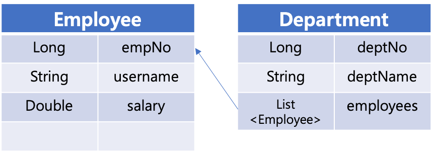

# OneToMany, 일대다, 1:N 관계

- AAAToBBB 일때 보통 AAA 가 주인이 되는 것이고 BBB에 외래키를 두는 것이라고 생각하면 될 것 같다.  
- OneToMany라는 이름이 붙은 것을 보면 One 이 주인테이블이고 Many 에 대응되는 쪽이 외래키로 매핑되는 테이블임을 유추할 수 있다.

  

# 1. 단방향

- 권장되는 방식은 아니다.

  - 1:N (일대다) 단방향 매핑보다는 N:1 (다대일) 단방향을 사용하다가 필요시에 양방향으로 추가해주는 방식으로 하는 것이 권장되는 편.

- @JoinColumn 을 사용해 자기 자신의 테이블 내에서 상대 테이블이 조인할 컬럼을 지정해준다. (이 컬럼으로 조인하세요. 라는 의미)

- @JoinColumn 을 사용하지 않으면 중간에 매핑 테이블이 하나 더 생긴다.

  - @JoinColumn 을 사용하지 않을 경우 JoinTable 방식을 사용하게 된다.
  - JPA가 테이블을 하나 더 추가해주는 것

- 단점으로는 insert 하고나서 update 쿼리도 나간다는 점이다. 

  - 운영상에서 성능 상의 이슈를 낼 수 있다는 점이 단점이다. 
  - 또한 실무에서 관리하게 되는 테이블의 갯수만 해도 엄청나게 많기 때문에 이런 경우는 관리가 힘들어진다.

- 분명 나는 Department에 손을 댔는데, 왜 Employee 테이블에 update 쿼리가 나가지? 하는 의문점이 생기기 쉽다. (1.2. 엔티티 매핑 참고)


  

## 1.1. ERD

Employee, Department 테이블 간의 단방향 매핑 관계를 ERD로 표현해보면 아래와 같다.  

- Department의 데이터 **하나**(PK, DEPT_NO)에 대해서  
  - (One : Department)
- Employee 테이블의 **여러 개**의 데이터 (FK,DEPT_NO)를 매핑하고 있다.
  - (Many : Employee)


  

## 1.2. 객체 관계 표현 (엔티티 매핑)

> - One To Many (일대 다) 관계는 항상 N(다) 쪽에 외래키가 있다.  
>
> - 객체와 테이블의 차이 때문에 반대편 테이블의 외래키를 관리하는 특이한 구조를 가지고 있다.
> - **@OneToMany 인 쪽에서 @JoinColumn 을 통해 관계를 맺는다.**

  




  

Department 안에는 List \<Employee> employees 가 있다. 하지만, Employee 에서는 Department 를 신경쓰고 싶지 않을 경우 사용한다.

- 아래 코드에서 보다시피 Employee 내부에는 어떠한 mappedBy 등의 코드가 없다.


## 1.3. 예제

### Employee.java

```java
@Builder
@Getter @Setter
@Entity(name = "EMPLOYEE")
public class Employee {

	@Id @GeneratedValue
	@Column(name = "EMP_NO")
	private Long id;

	@Column(name = "USERNAME")
	private String username;

	@Column(name = "SALARY")
	private Double salary;

}
```

  

### Department.java

```java
@Builder
@Getter @Setter
@Entity(name = "DEPARTMENT")
public class Department {

	@Id @GeneratedValue
	@Column(name = "DEPT_NO")
	private Long deptNo;

	@Column(name = "DEPT_NAME")
	private String deptName;

	@OneToMany
	@JoinColumn(name = "DEPT_NO")
	private List<Employee> employees = new ArrayList<>();

}
```

  

### 테스트 코드

```java
@SpringBootTest
@Transactional
@Commit
public class MappingTest {

	@Autowired
	private EntityManager em;

	@Test
	void testInsertEmployees(){
		System.out.println("======= Employee 객체 생성 =======");
		Employee e1 = Employee.builder()
			.username("경찰관#1")
			.salary(1000D)
			.build();

		System.out.println("======= em.persist(e1) =======");
		em.persist(e1);

		System.out.println("======= Department 객체 생성 =======");

		Department d1 = Department.builder()
			.deptName("소하1동경찰서")
			.employees(new ArrayList<>())
			.build();							// DEPARTMENT 테이블에 INSERT 하면 되는 내용이다.

		System.out.println("======= Department.employees.add(e1) =======");
		d1.getEmployees().add(e1);				// DEPARTMENT 테이블에 INSERT 될수 있는 내용은 아니다.
												// DEPARTMENT 테이블이 아니라 EMPLOYEE 테이블을 UPDATE 하게 된다.

		System.out.println("======= em.persist(d1) =======");
		em.persist(d1);
	}

	@AfterEach
	void close(){
		em.close();
	}
}
```

  

### 출력결과

> 참고)  
>
> 위의 테스트 코드에서 @Commit 을 붙이지 않거나 em.commit() 을 명시적으로 호출해주지 않으면 update 쿼리는 나가지 않는다.

  

```plain
... 중략 ...
======= Employee 객체 생성 =======
======= em.persist(e1) =======
2020-09-05 15:28:23.684 DEBUG 26212 --- [           main] org.hibernate.SQL                        : 
    insert 
    into
        employee
        (salary, username) 
    values
        (?, ?)
======= Department 객체 생성 =======
======= Department.employees.add(e1) =======
======= em.persist(d1) =======
2020-09-05 15:28:23.704 DEBUG 26212 --- [           main] org.hibernate.SQL                        : 
    insert 
    into
        department
        (dept_name) 
    values
        (?)
2020-09-05 15:28:23.723 DEBUG 26212 --- [           main] org.hibernate.SQL                        : 
    update
        employee 
    set
        dept_no=? 
    where
        emp_no=?
... 중략
```


# 2. 양방향

- 공식적으로 지원하는 방식은 아니다.
- 
  을 Employee 클래스 내의 department 매핑에 추가해준다.
- 읽기 전용 필드로 만들어서 양방향인 것 처럼 사용하는 방식이다.
- 1:N 단방향/양방향 보다는 N:1 양방향이 권장된다.


예를 들면 아래의 코드와 같이 Employee 클래스 내에 department 매핑에 `insertable=false` , `updatable=false` 와 같은 속성을 추가해주어야 한다. 

```java
// ...
@Entity(name = "EMPLOYEE")
public class Employee{
  // ...
  @JoinColumn(name="DEPT_NO", insertable=false, updatable=false)
  private Department department;  
  // ...
}

```


## 2.1. ERD

## 2.2. 객체 관계 표현 (엔티티 매핑)


## 2.3. 예제

### Employee.java

```java
@Builder
@Getter @Setter
@Entity(name = "EMPLOYEE")
public class Employee {

	@Id
	@GeneratedValue
	@Column(name = "EMP_NO")
	private Long id;

	@Column(name = "USERNAME")
	private String username;

	@Column(name = "SALARY")
	private Double salary;

	@ManyToOne
	@JoinColumn(name = "DEPT_NO", insertable = false, updatable = false)
	private Department department;
}
```

  

### Department.java

```java
@Builder
@Getter @Setter
@Entity(name = "DEPARTMENT")
public class Department {

	@Id
	@GeneratedValue
	@Column(name = "DEPT_NO")
	private Long deptNo;

	@Column(name = "DEPT_NAME")
	private String deptName;

	@OneToMany
	@JoinColumn(name = "DEPT_NO")
	private List<Employee> employees = new ArrayList<>();

}
```

  

### 테스트 코드

```java
package io.study.erd_example.onetomany.entity;

import java.util.ArrayList;
import javax.persistence.EntityManager;
import org.junit.jupiter.api.AfterEach;
import org.junit.jupiter.api.Test;
import org.springframework.beans.factory.annotation.Autowired;
import org.springframework.boot.test.context.SpringBootTest;
import org.springframework.test.annotation.Commit;
import org.springframework.transaction.annotation.Transactional;

@SpringBootTest
@Transactional
@Commit
public class MappingTest {

	@Autowired
	private EntityManager em;

	@Test
	void testMapping(){
		System.out.println("======= Employee 객체 생성 =======");
		Employee e1 = Employee.builder()
			.username("경찰관#1")
			.salary(1000D)
			.build();

		System.out.println("======= em.persist(e1) =======");
		em.persist(e1);

		System.out.println("======= Department 객체 생성 =======");

		Department d1 = Department.builder()
			.deptName("소하1동경찰서")
			.employees(new ArrayList<>())
			.build();							// DEPARTMENT 테이블에 INSERT 하면 되는 내용이다.

		System.out.println("======= Department.employees.add(e1) =======");
		d1.getEmployees().add(e1);				// DEPARTMENT 테이블에 INSERT 될수 있는 내용은 아니다.
												// DEPARTMENT 테이블이 아니라 EMPLOYEE 테이블을 UPDATE 하게 된다.

		System.out.println("======= em.persist(d1) =======");
		em.persist(d1);
	}

	@AfterEach
	void close(){
		em.close();
	}
}
```

  

### 출력결과

```plain
... 중략 ...
======= Employee 객체 생성 =======
======= em.persist(e1) =======
2020-09-05 16:47:57.226 DEBUG 28127 --- [           main] org.hibernate.SQL                        : 
    insert 
    into
        employee
        (salary, username) 
    values
        (?, ?)
======= Department 객체 생성 =======
======= Department.employees.add(e1) =======
======= em.persist(d1) =======
2020-09-05 16:47:57.249 DEBUG 28127 --- [           main] org.hibernate.SQL                        : 
    insert 
    into
        department
        (dept_name) 
    values
        (?)
2020-09-05 16:47:57.270 DEBUG 28127 --- [           main] org.hibernate.SQL                        : 
    update
        employee 
    set
        dept_no=? 
    where
        emp_no=?
... 중략 ...
```

