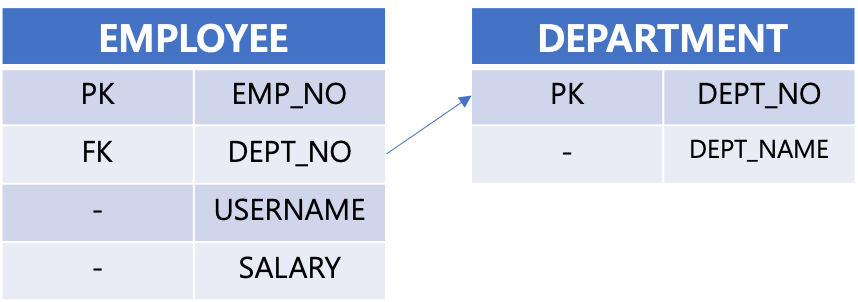
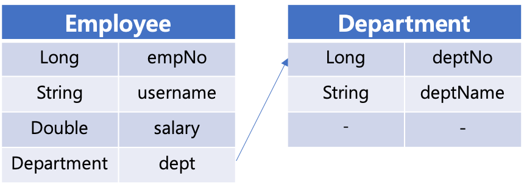

# Many To One (다대일, N:1)

> 다대일 이라는 단어가 와닿지가 않기도 하고 왠지 일본어 같은 느낌도 있어서 원래 의미인 ManyToOne 이라는 이름으로 정리하기로 했다. (영어를 좋아하는 편은 아니지만 ManyToOne 이라는 단어가 더 잘 이해되는 것 같기도 하다.)


# 참고자료

- [자바 ORM 표준 JPA 프로그래밍](http://www.yes24.com/Product/Goods/19040233?OzSrank=4)
- [JPA Join Column -Baeldung](https://www.baeldung.com/jpa-join-column)


# ManyToOne 이란 ?

- **ManyToOne** 이라는 용어는 **"Many 에서 One으로 향한다"** 라는 의미로 기억한다면 조금 더 직관적인것 같다.
- Many 에 외래키를 두고, JPA에서는 이 외래키가 위치한 클래스를 **연관관계의 주인**이라고 하는 듯 하다.
- Many 에 해당하는 쪽인 Employee 에서 @JoinColumn 을 통해 관계를 맺는다.
- @JoinColumn 어노테이션은 외래키로 사용할 컬럼을 상대편 테이블의 컬럼을 지정하는 역할을 한다.
- @JoinColumn 이 지정된 필드는 DDL 로 테이블 생성시 외래키로 지정된다.
- 양방향 매핑시 상대편 객체내에서 주인 객체를 바라보는 Collection 타입의 필드에는 mappedBy 를 통해 읽기전용 필드를 지정해준다.


# 연관관계 매핑

- 연관관계의 주인은 Many 측에 해당하는 측이다.
- Employee, Department 를 예로 들어보면 Employee 가 연관관계의 주인이다.
- Department 는 연관관계의 주인인 Employee 객체들을 리스트로 가진다. 예제에서는 employees 라는 이름의 리스트로 선언했다.
- 이 employees 는 객체 그래프를 탐색할 때 사용하게 된다.


# 0. 연관관계 헬퍼 메서드

> [자바 ORM 표준 JPA 프로그래밍](http://www.yes24.com/Product/Goods/19040233?OzSrank=4) 내에서는 편의메서드 라는 용어로 사용되었고, 편의 메서드라고 하니 매번 기억이 잘 나지 않아서 헬퍼메서드라는 이름으로 기억하기로 했다.

- 양방향 연관관계는 항상 서로를 참조해야 한다. 이때 서로를 참조하기 위해서는 save(), remove() 등의 동작을 수행시에, 객체에 대한 값을 동기화하는 별도의 작업이 필요하다.

- 예를 들면 서로를 참조하게 하기 위해서 별도의 함수 내에 save(), remove() 등의 동작을 수행할 때 아래의 동작이 필요하다.

- - e1.setTeam(team1);
  - team1.addMember(member);

- 이런 메서드를 각 논리적인 메서드들에서 개별로 호출하게끔 할 경우 프로그래머의 실수가 나올 수 밖에 없다. 논리적인 의미를 가진 CRUD 연산에 대한 객체의 상태를 동기화하는 연산은 따로 편의 메서드 내에 고정시키는 것이 코딩 관례(코딩 컨벤션)으로 권장되는 듯 하다.

- - e1.setTeam(team1);
  - team1.addMember(member);
  - 이 메서드들이 아래의 예제에서 어디에서 쓰이는지 확인해보자.


# 1. 단방향

> **Many 에 해당하는 쪽인 Employee 에서 @JoinColumn을 통해 관계를 맺는다.**  

- @JoinColumn 을 Employee.department 에 두었다.
- @JoinColumn 의 경우 @ManyToOne 일때에 사용하는 것이 일반적이라고 한다. 
  - (그 반대인 OneToMany인 필드를 @JoinColumn 으로 외래키지정할 경우는 상대편 테이블의 외래키를 참조하는 대체방식을 선택하게 된다.)

- 단방향에서는 상대편 객체인 Department에서는 아무 작업도 하지 않는다.  
  - (양방향에서는 상대편인 Department 객체내에서 조회를 위해 필요한 List\<Employees\>를 mappedBy 한다.)


## 1.1. ERD




## 1.2. 객체 관계 표현 (엔티티 매핑)

- ManyToOne (다대 일)관계. 즉, Many 가 객체관계에서 주인 역할을 수행한다.
- Many에 해당하는 측인 Employee 에서 @JoinColumn 을 통해 관계를 맺는다.
  - @JoinColumn 은 현재 객체 내에서 어떤 필드를 외래키로 둘지를 의미한다.
- 상대편 객체인 Department 에는 아무 작업도 하지 않는다.  





## 1.3. 예제

### Employee.java

```java
@Builder
@Getter @Setter
@Entity(name = "EMPLOYEE")
public class Employee {

	@Id
	@GeneratedValue
	@Column(name = "EMP_NO")
	private Long id;

	@Column(name = "USERNAME")
	private String username;

	@Column(name = "SALARY")
	private Double salary;

	@ManyToOne
	@JoinColumn(name = "DEPT_NO")
	private Department department;
}
```

  

### Department.java

```java
@Builder
@Getter @Setter
@Entity(name = "EMPLOYEE")
public class Employee {

	@Id
	@GeneratedValue
	@Column(name = "EMP_NO")
	private Long id;

	@Column(name = "USERNAME")
	private String username;

	@Column(name = "SALARY")
	private Double salary;

	@ManyToOne
	@JoinColumn(name = "DEPT_NO")
	private Department department;
}
```

  

### 테스트 코드

```java
@SpringBootTest
@Transactional
@Commit
public class MappingTest {

	@Autowired
	private EntityManager em;

	@Test
	@DisplayName("N:1(다대일) 단방향 매핑 테스트 >>> ")
	void testMapping(){
		System.out.println("======= Department 객체 생성 =======");
		Department d1 = Department.builder()
			.deptName("소방서#1")
			.build();

		System.out.println("======= em.persist(department) =======");
		em.persist(d1);

		System.out.println("======= Employee 객체 생성 =======");
		Employee e1 = Employee.builder()
			.salary(2000D)
			.username("소방관#1")
			.department(d1)
			.build();

		System.out.println("======= em.persist(employee) =======");
		em.persist(e1);
	}

}
```


### 출력결과

```plain
======= Department 객체 생성 =======
======= em.persist(department) =======
2020-09-05 20:07:53.573 DEBUG 30135 --- [           main] org.hibernate.SQL                        : 
    insert 
    into
        department
        (dept_name) 
    values
        (?)
======= Employee 객체 생성 =======
======= em.persist(employee) =======
2020-09-05 20:07:53.588 DEBUG 30135 --- [           main] org.hibernate.SQL                        : 
    insert 
    into
        employee
        (dept_no, salary, username) 
    values
        (?, ?, ?)
```


# 2. 양방향

- ManyToOne (다대 일)관계. 즉, Many 가 객체관계에서 주인 역할을 수행한다.
  - 연관관계의 주인 객체는 @ManyToOne 을 통해 상대편 객체의 필드와 @JoinColumn 을 맺는다.
- Many에 해당하는 측인 Employee 에서 @JoinColumn 을 통해 관계를 맺는다.
  - @JoinColumn 은 현재 객체 내에서 어떤 필드를 외래키로 둘지를 의미한다.
- 상대편 객체인 Department 에서는 mappedBy 를 통해 연관관계의 주인 객체내의 외래키 필드에 해당하는 멤버필드명을 참조한다.
  - 상대편 객체인 Department 는 ManyToOne의 반대입장이므로 OneToMany 이다.
  - (ex. @OneToMany (mappedBy = "department"))

## 1.1. ERD


  

## 1.2. 객체 관계 표현 (엔티티 매핑)

- Many에 해당하는 측인 Employee 에서 @JoinColumn 을 통해 관계를 맺는다.
  - @JoinColumn 은 현재 객체 내에서 어떤 필드를 외래키로 둘지를 의미한다.
- **상대편 객체**인 Department 에서는 **mappedBy** 를 통해 연관관계의 주인 객체내의 외래키 필드에 해당하는 멤버필드명을 참조한다.
  - 상대편 객체인 Department 는 ManyToOne의 반대입장이므로 OneToMany 이다.
  - (ex. @OneToMany (mappedBy = "department"))


  

## 1.3. 예제

### Employee.java

```java
@Builder
@Getter @Setter
@Entity(name = "EMPLOYEE")
public class Employee {

	@Id
	@GeneratedValue
	@Column(name = "EMP_NO")
	private Long id;

	@Column(name = "USERNAME")
	private String username;

	@Column(name = "SALARY")
	private Double salary;

	@ManyToOne
	@JoinColumn(name = "DEPT_NO")
	private Department department;
}
```

  

### Department.java

```java
@Builder
@Getter @Setter
@Entity(name = "DEPARTMENT")
public class Department {

	@Id @GeneratedValue
	@Column(name = "DEPT_NO")
	private Long id;

	@Column(name = "DEPT_NAME")
	private String deptName;

	@OneToMany(mappedBy = "department")
	private List<Employee> employees = new ArrayList<>();

	public void addEmployee(Employee e){
		e.setDepartment(this);
		employees.add(e);
	}
}
```

  

### 테스트 코드

```java
@SpringBootTest
@Transactional
@Commit
public class MappingTest {

	@Autowired
	private EntityManager em;

	@Test
	@DisplayName("N:1(양방향) 매핑관계 테스트 ")
	public void testMapping(){

		System.out.println("======= Department 객체 생성 =======");
		Department d1 = Department.builder()
			.deptName("소하1동 소방서")
			.employees(new ArrayList<>())
			.build();

		System.out.println("======= em.persist(department) =======");
		em.persist(d1);

		System.out.println("======= Employee 객체 생성 =======");
		Employee e1 = Employee.builder()
			.salary(5000D)
			.username("소방관@1")
			.department(d1)
			.build();

		d1.addEmployee(e1);

		System.out.println("======= em.persist(employee) =======");
		em.persist(e1);
	}
}
```

  

### 출력결과

```plain
======= Department 객체 생성 =======
======= em.persist(department) =======
2020-09-05 20:51:28.412 DEBUG 31345 --- [           main] org.hibernate.SQL                        : 
    insert 
    into
        department
        (dept_name) 
    values
        (?)
======= Employee 객체 생성 =======
======= em.persist(employee) =======
2020-09-05 20:51:28.428 DEBUG 31345 --- [           main] org.hibernate.SQL                        : 
    insert 
    into
        employee
        (dept_no, salary, username) 
    values
        (?, ?, ?)
```

