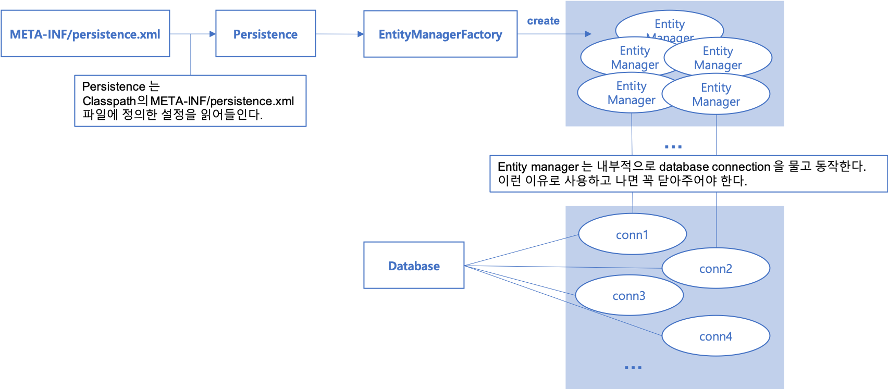
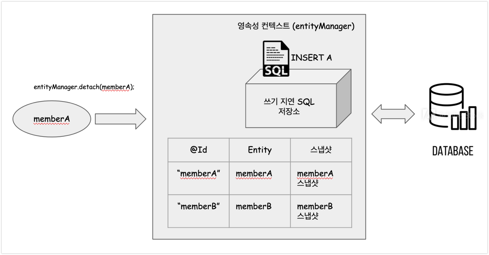
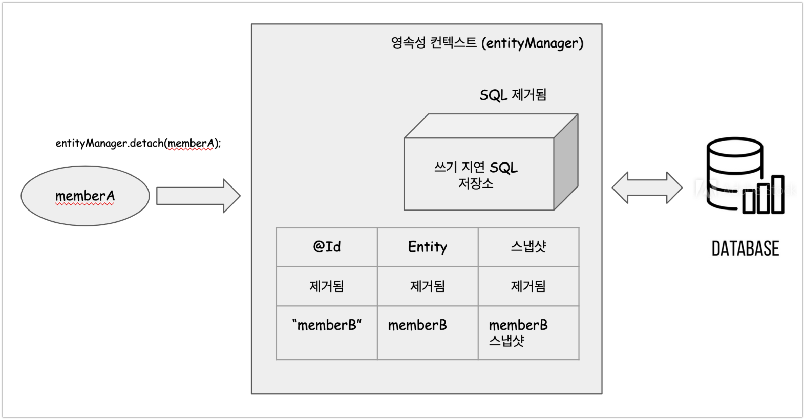

# 내부동작방식, 영속성 컨텍스트

# 참고자료

- 주교재
  - [자바 ORM 표준 JPA 프로그래밍](https://ridibooks.com/books/3984000009)

- 트랜잭셔널의 개념에 대해 찾아본 자료
  - [@Transactional 및 예제](https://goddaehee.tistory.com/167)  


# JPA 의 주요 러닝커브

- ORM
  - 객체지향 관점에서의 Database 표현방식
- 영속성 컨텍스트
  - 중요한 개념이고, 실무에서 자주 까먹기에 다시 꺼내오는 것을 자주 해야 한다고 함.
  - 동일성 (Identity) 보장 
  - 트랜잭션 지원 쓰기 지연 (Transactional Write Behind)
  - 변경감지 (Dirty Checking)
  - 지연로딩 (Lazy Loading)


# 1. 엔티티, 엔티티 매니저, 엔티티 매니저 팩토리


예전에 아무것도 모를때 JPA 강의 내용을 보고 혼자서 공부하면서 요약했었는데, 더 요약해서 간단하게 정리해보려고 하는 중이다.

## 엔티티 (Entity)

- 관계형 DB의 개념을 객체지향적으로 표현한 대상
- 테이블에 적재되는 데이터의 한 줄(로우)에 해당하는 데이터에 대한 객체지향적 매핑
- 테이블 구조를 논리적인 방식으로 표현
  - 논리적인 방식이라는 것은, 테이블을 사람의 논리적인 판단으로 그룹화해 표현한 것을 의미하는 듯 하다.


## 엔티티 매니저 (EntityManager)

- 엔티티를 관리(Mange)하는 녀석


## 엔티티 매니저 팩토리 (EntityManagerFactory)

- 엔티티 매니저 인스턴스를 관리하는 역할을 수행한다.


## 엔티티, 엔티티 매니저, 엔티티 매니저 팩토리 각각의 역할/관계




# 2. 영속성 컨텍스트 

> 참고자료 : [자바 ORM 표준 JPA 프로그래밍](https://ridibooks.com/books/3984000009)


## 엔티티의 영속화

> - 비영속
> - 영속
> - 삭제
> - 준영속

엔티티는 비영속 -> 영속 -> 삭제 를 통해 상태가 변화한다. **영속 상태**라는 것은 일반 객체가 EntityManager 를 통해 영속성 컨텍스트 내에서 관리되는 객체가 되는 것을 의미한다. 즉, EntityManager에게 영속화 되기를 원하는 엔티티 인스턴스를 넘겨주어 메모리에 영속화하는 것을 영속화라고 이야기 한다. **비영속 상태**는 일반 객체 상태로, 아직 EntityManager에 영속화 해두지 않은 상태이다.   

  

**준영속 상태**는 영속 상태의 엔티티가 영속성 컨텍스트에서 분리된 것을 **준영속 상태**라고 한다. 준영속 상태의 엔티티는 영속성 컨텍스트가 제공하는 기능을 사용할 수 없다. 영속상태의 엔티티를 준 영속 상태로 만드는 방법은 크게 3가지이다.  

- em.detach(entity)
  - 특정 엔티티만 준영속 상태로 전환한다.
- em.clear()
  - 영속성 컨텍스트를 완전히 초기화한다.
- em.close()
  - 영속성 컨텍스트를 종료한다.


**준영속**에 대한 자세한 내용은 하단에 **4.준영속** 에 자세히 정리해두었다.

  

## 영속성 컨텍스트의 특징

> 이 부분이 책 [자바 ORM 표준 JPA 프로그래밍](https://ridibooks.com/books/3984000009) 에서도 힘들게 되어 있는 부분이어서 정리하는 데에 애를 조금 많이(굉장히 많이) 먹었다.   


- 식별자 값 
  - 식별자 값으로 엔티티를 구분한다.
  - 엔티티의 식별자 값인 @Id(테이블의 기본키와 매핑한 값)로 엔티티를 구분한다.
  - 따라서 영속상태는 식별자 값이 반드시 있어야 한다. (식별자 값이 없으면 예외가 발생한다.)
- 플러시
  - 엔티티는 영속성 컨텍스트에 저장한다.
  - 그리고 이 영속성 컨텍스트 내의 엔티티는 트랜잭션을 커밋 해야 데이터베이스에 반영된다.
  - 이렇게 트랜잭션의 커밋을 통해 Database 에 반영하는 것을 플러시(flush)라고 한다.


## 영속성 컨텍스트로 엔티티를 관리하는 것의 장점

- 1차 캐시 사용
- 동일성 보장
- 트랜잭션을 지원하는 쓰기 지연
- 변경 감지 (Dirty Checking)
- 지연 로딩


# 3. 플러시 (flush)

- flush() 는 영속성 컨텍스트의 변경 내용을 데이터베이스에 반영하는 것을 의미한다. 
- 영속성 컨텍스트의 변경 내용을 데이터베이스에 동기화 하는 작업을 플러시라고 한다.
- 영속성 컨텍스트를 사용함으로써 데이터베이스와 데이터를 동기화하는 시점을 최대한 늦추는 것이 가능해지는데, 이것은 트랜잭션이라는 작업단위를 사용하기 때문이다. 엔티티 매니저 입장에서의 트랜잭션 커밋 직전에만 변경 내용을 데이터베이스에 보내 동기화하게 된다.
- 참고) [@Transactional 및 예제](https://goddaehee.tistory.com/167)  
- 흔히 착각하게 되는 내용)
  - 플러시라는 이름으로 인해 영속성 컨텍스트 내에 보관된 엔티티를 지운다고 오해하는 경우가 많다고 한다.

  

## 플러시(flush) 후의 내부 동작

- 변경감지(Dirty Checking) 동작
  - 변경감지 라는 것은 영속성 컨텍스트에 있는 모든 엔티티를 스냅샷과 비교해 수정된 엔티티를 찾는 과정을 의미한다.
  - 수정된 엔티티는 수정 쿼리를 만들어서 쓰기 지연 SQL 저장소에 등록한다.
- 쓰기 지연 SQL 저장소의 쿼리를 Database 에 전송 (등록, 수정, 삭제 쿼리)

  

## 영속성 컨텍스트를 플러시(flush)하는 방법 3가지

- 엔티티 매니저의 flush() 메서드를 직접 사용
  - entityManager.flush(); 와 같은 코드로 직접 호출
  - 영속성 컨텍스트를 강제로 플러시하는 방식
  - 테스트나 다른 프레임워크와 JPA를 함께 사용할 경우를 제외하면 거의 미사용 
    - (스프링 외의 프레임웍에서 사용할 경우 flush()를 사용할수도 있다는 의미로 보임)
- 트랜잭션을 커밋한다.
  - 트랜잭션 커밋 시 플러시가 자동으로 호출된다.
  - entityManager.getTransaction().commit(); 과 같은 코드로 직접 호출 가능하다.
  - 참고) [@Transactional 및 예제](https://goddaehee.tistory.com/167) 를 참고해서 트랜잭션에 대해 조금 더 공부해보자.
- JPQL 쿼리 실행
  - JPQL 쿼리 실행시 플러시가 호출된다.
  - JPQL 이나 Creteria(10장) 와 같은 객체지향 쿼리 호출시 플러시가 실행된다.

  

### JPQL 쿼리 실행시 플러시가 자동으로 호출되는 원리

- **JPQL**은 SQL로 변환되어 **영속성 컨텍스트를 거치지 않고 DBMS에서 직접 엔티티를 조회**한다. 
- 그리고 JPQL을 호출할 때 플러시를 통해서 데이터베이스에 영속성 컨텍스트의 내용을 반영한다. 
- 참고) 식별자(@Id, 기본키)를 기준으로 조회하는 find() 메서드를 호출할 때는 플러시가 실행되지 않는다.

이렇게 하는 이유는 메모리 상에 존재하는 영속성 컨텍스트 내의 데이터와 DBMS에 영속화된 데이터는 데이터가 다른 상태이기 때문에, DB 조회결과와 영속성 컨텍스트의 데이터를 일치시키기 위해서 이다. 

예를 들어보면 이렇다. JPQL로 어떤 데이터 하나를 검색하는 쿼리를 작성해서 실행했다. 그런데 이 때 엔티티 들 중 몇몇 엔티티들은 메모리 상의 데이터인 영속성 컨텍스트에만 있고, Database에는 반영되지 않은 상태이다. 즉, **영속성 컨텍스트**와 **DBMS에 존재하는 데이터**가 **서로 다른 상태**이다. 이 때 JPQL 은 영속성 컨텍스트를 먼저 flush 해놓고 조회를 해와서 다시 영속성 컨텍스트를 업데이트 한다면 DBMS 내의 데이터와 영속성 컨텍스트 간의 데이터가 다르게 되는 문제를 해결할 수 있게 된다.  

  

**예제)**

```java
em.persist(memberA);
em.persist(memberB);
em.persist(memberC);

// 중간에 JPQL 실행
query = em.createQuery("select m from Member m", Member.class);
List<Member> members = query.getResultList();
```


memberA, memberB, memberC 를 영속 상태로 만들었다. 이 엔티티들은 영속성 컨텍스트에는 존재하지만 DBMS에는 반영되지 않은 상태이다. **이때 JPQL을 실행하게 되면, JPQL은 영속성 컨텍스트를 플러시(flush)해서 데이터베이스에 영속성 컨텍스트의 내용을 반영**한 후, **데이터베이스에 SQL을 수행**한다.

  

## 플러시 모드의 옵션들

> 엔티티 메니저에 플러시 모드를 직접 지정할 수 있는데 이 때 FlushModeType 이라는 enum 을 사용한다. 

플러시 모드를 별도로 설정하지 않으면 AUTO 로 동작한다. 트랜잭션 커밋이나 쿼리 실행시에 플러시를 자동으로 호출한다. 또는 트랜잭션을 커밋할 때에만 플러시를 하고 싶다면 FlushModeType.COMMIT 을 엔티티 매니저에 직접 지정하면 된다.

- FlushModeType.AUTO
  - 기본값
  - 트랜잭션 커밋 또는 쿼리를 실행할 때 플러시
- FlushModeType.COMMIT
  - 커밋할 때만 플러시


# 4. 준영속

**준영속 상태**는 영속 상태의 엔티티가 영속성 컨텍스트에서 분리된 것을 **준영속 상태**라고 한다. 준영속 상태의 엔티티는 영속성 컨텍스트가 제공하는 기능을 사용할 수 없다. 영속상태의 엔티티를 준 영속 상태로 만드는 방법은 크게 3가지이다.  

- em.detach(entity)
  - 특정 엔티티만 준영속 상태로 전환한다.
- em.clear()
  - 영속성 컨텍스트를 완전히 초기화한다.
- em.close()
  - 영속성 컨텍스트를 종료한다.


이 외에도 merge() 함수 역시 있다. 이 부분에 대해서는 나중에 내용을 더 공부해서 정리하게 될 것 같다.


## detach(Object entity)

- [EntityManager](https://docs.oracle.com/javaee/7/api/javax/persistence/EntityManager.html) 의 detach(Object entity) 메서드는 특정 엔티티를 **준영속 상태**로 만든다.
- **준영속 상태**는 **영속성 컨텍스트로부터 분리(detached)된 상태**이다.

```java
public void testDetached(){
  // ...
  
  // 회원 엔티티 생성, 비영속 상태
  Member member = new Member();
  member.setId("memberA");
  member.setUsername("회원 A");
  
  // 회원 엔티티 영속상태
  em.persist(member);
  
  // 회원 엔티티를 영속성 컨텍스트에서 분리, 준영속 상태
  em.detach(member);
  
  // 트랜잭션 커밋
  transaction.commit();
}
```


위의 예를 그림으로 표현해보면 아래와 같다.

**detach(memberA) 수행 전**



  

**detach(memberB) 수행 후**  

- 영속성 컨텍스트 내에서 memberA 객체들이 사라졌다.
- 쓰기 지연 저장소에 있던 SQL 역시 없어졌다.




## clear()

> 영속성 컨텍스트 내의 모든 엔티티를 준영속 상태로 만드는 EntityManater 내의 메서드이다.

- em.clear() 는 영속성 컨텍스트를 초기화한다.
- 영속성 컨텍스트를 초기화하면 영속성 컨텍스트 내의 모든 엔티티가 준영속(detached) 상태가 된다.

  

!TODO :: 그림은 이번 주 중으로 추가


## close()

> 영속성 컨텍스트를 종료하는 EntityManager 내의 메서드이다.

- 영속성 컨텍스트를 종료하면 영속성 컨텍스트가 관리하던 영속상태의 엔티티가 모두 준영속 상태가 된다.
- 개발자가 직접 준영속  상태로 만드는 일은 드물다.


!TODO :: 그림은 이번 주 중으로 추가


## 준영속 상태의 특징

- 거의 비영속 상태에 가까운 상태
  - 영속성 컨텍스트가 관리하지 않기 때문에 1차 캐시, 쓰기지연, 변경감지, 지연로딩 등의 영속성 컨텍스트가 제공하는 어떠한 기능도 동작하지 않는다.
- 식별자 값이 있다.
  - 영속성 상태였다가 비영속 상태가 된것이기 때문에 객체 내에 식별자 값을 가지고 있다.
- 지연 로딩이 불가능하다.
  - 지연 로딩(lazy loading) 
    - 실제 객체 대신 프록시 객체를 로딩해두고 해당 객체를 실제 사용할 때 영속성 컨텍스트에서 데이터를 불러오는 방식 
  - 준영속 상태는 영속성 컨텍스트가 더는 관리하지 않기 때문에 지연 로딩시 문제가 발생한다. 
  - (8장에서 정리. !TODO 이부분 요약설명 추가 예정)

