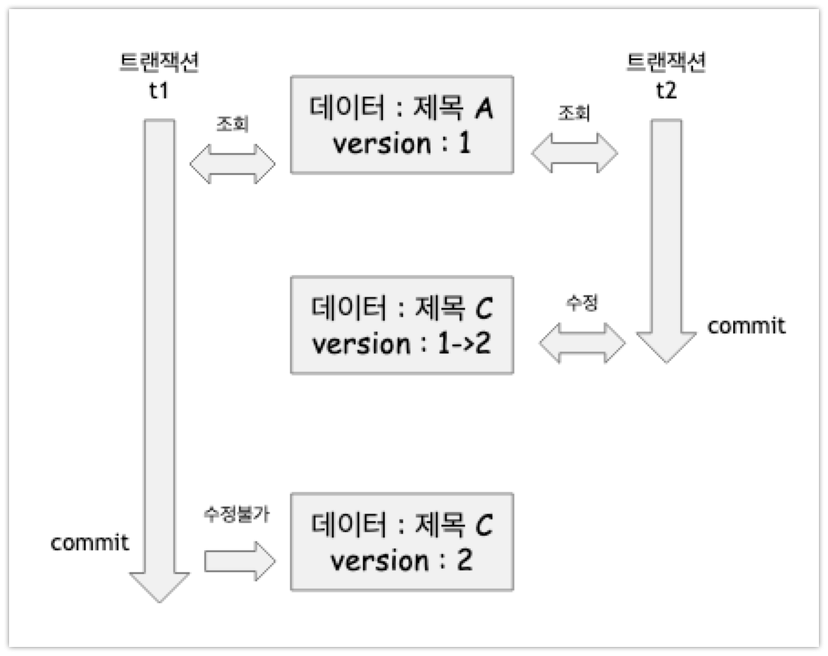

# JPA의 버전관리 기능

여러 개의 트랜잭션으로 열어두고 있는 데이터베이스 내의 데이터가 있다고 해보자. 이때 여러명의 사용자가 순차적으로 수정을 하는 경우를 생각해볼 수 있다. 이때 가장 마지막 커밋만 인정하는 것은 굉장히 쉬운 해결책이다. 하지만, 충돌하는 갱신 내용을 병합하거나, 최초 커밋만 인정하는 것은 어려운 방식이다.  

최초 커밋을 인정하도록 하는 방식은 다행히도 JPA에서 제공하는 @Version 애노테이션으로 해결 가능하다.   

  

# 참고자료

[자바 ORM 표준 JPA 프로그래밍](https://ridibooks.com/books/3984000009)


# 두 번의 갱신 문제 (second lost updates problem)

뒤에서도 정리하게 되겠지만 버전관리를 사용하게 되는 배경을 예로 들어 먼저 정리해두어야 할 것 같다.

> 사용자 A와 사용자 B가 있다. A, B 모두 제목이 같은 공지사항을 수정한다고 해보자. 누군가가 이미 작성해둔 공지사항 게시물을 열어서 수정하고 있다.  
>
> - 이때 사용자A가 먼저 수정완료 버튼을 눌렀다.
> - 잠시 후, 사용자 B가 수정완료 버튼을 눌렀다.
> - 결과적으로 먼저 완료한 사용자 A의 수정사항은 사라지고 나중에 완료한 사용자 B의 수정사항만 남게 된다.
>
> 이것을 두번의 갱신 분실 문제 (second lost updates problem)라고 한다.





두 번의 갱신 분실 문제는 데이터베이스 트랜잭션의 범위를 넘어선다. 따라서 트랜잭션만으로는 문제를 해결할 수 없다. 이때 이 문제를 해결하는 3가지 원칙이 있는데 아래와 같다.  

- 마지막 커밋만 인정하기
  
  - 사용자 A의 내용은 무시, 마지막에 커밋한 사용자인 B의 내용만 인정
- 최초 커밋만 인정하기
  
  - 최초 커밋만 인정한다. 사용자 A가 이미 수정을 완료했기 때문에 사용자 B가 수정할 경우 오류가 발생한다.
- 충돌하는 갱신 내용 병합하기
  - 사용자 A와 사용자 B의 수정사항을 병합한다.

  

가장 기본적인 옵션은 **마지막 커밋만 인정하기** 이다. 하지만 상황에 따라서 최초커밋만 인정하기를 사용해야만 하는 경우가 있다.    

**최초 커밋만 인정하기**는 언뜻 보기에 굉장히 어려워 보인다. 직접 구현할경우 정말 어렵게 느껴질 것 같다. 다행히도 JPA 에서는 버전관리 기능을 제공하는데, 이 버전관리 기능을 이용하면 **최초 커밋만 인정하기**를 쉽게 구현할 수 있다. @Version 이라는 애노테이션을 이용해서 구현 가능하다.  

  

> **충돌하는 갱신 내용 병합하기**
>
> - git merge를 할 때 conflict 나는 부분을 찾아서 병합하는 경우가 있다. 그런데 애플리케이션을 개발하는 입장에서는 데이터가 서로 다른 점을 파악해서 충돌한 부분을 병합하는 로직은 직접 애플리케이션 개발자가 구현해야 한다. (당연하지만, JPA 에서 충돌을 병합해주는 방법을 제공해주는 않는다.)


# JPA의 버전관리 애노테이션 @Version

@Version 을 사용하면 버전 정보를 사용하게 된다. 이렇게 하면 JPA의 내부동작에 의해 최초 커밋만 인정하기가 적용된다.

@Version 을 적용할 수 있는 타입은 아래의 4가지 이다.

- Long(long)
- Integer(int)
- Short(short)
- Timestamp

버전 관리 기능을 적용하려면 아래와 같이 엔티티에 버전 관리용 필드를 하나 추가하고 @Version을 붙이면 된다.

```java
@Entity
public class Board{
  @Id
  private String id;
  private String title;
  
  @Version
  private Integer version;
}
```


아래는 저장할 때의 로직이다.

```java
// 트랜잭션 1 조회 title = "제목 A", version = 1
Board board = em.find(Board.class, id);

// 다른 스레드에서 돌아가는 인스턴스에서는 트랜잭션 2를 가지고 있고, 
// 해당 게시물을 수정해서 title="제목 C", version = 2 로 증가해놓은 상황이다


// 트랜잭션 1 의 문맥에서는 데이터를 수정하기 위한 절차를 시작
// 제목을 "제목B" 로 수정했다.
board.setTitle("제목B");

// 저장.
save(board);
// 커밋 시에는 예외가 발생한다.
tx.commit(); // 예외발생. 데이터베이스 version=2, 엔티티 version = 1
```


이렇게 하면 엔티티를 수정할 때마다 버전이 하나씩 자동으로 증가한다. 그리고 엔티티를 수정할 때

- 조회시점의 버전과
- 수정 시점의 버전이 다르다면

예외가 발생한다.  

  

위의 **두번의 갱신문제**에 첨부한 그림을 다시 살펴보자.


- 트랜잭션 t1 이 데이터를 조회해서 엔티티를 수정하고 있다.
- 트랜잭션 t2 에서 같은 엔티티를 조회해서 수정하고 커밋했다.
- 커밋을 하게 되엇으므로 버전이 증가해서 버전이 1에서 2로 변경되었다.(1->2)
- 트랜잭션 t1 이 커밋하려고 할때는 조회할 때의 version(=1)과 다른 상태이므로 예외가 발생한다.


# JPA 내부 동작원리 - 버전 정보 비교

엔티티의 값을 변경하면 버전은 증가한다. JPA가 버전 정보를 비교하는 방법은 단순하다. 엔티티 수정 후 트랜잭션을 커밋하면 영속성 컨텍스트를 플러시 하면서 아래와 같은 UPDATE 쿼리를 실행한다. 버전을 엔티티에 추가한 상태이므로 아래와 같이 UPDATE 문의 WHERE 문에 VERSION 조건을 추가해서 쿼리를 수행한다.

```sql
UPDATE BOARD
SET
	TITLE = ?,
	VERSION = ?			-- 버전+1 증가
WHERE
	ID = ?
	AND VERSION = ? -- 버전 비교
```


- 데이터베이스의 버전과 엔티티 버전이 같으면 데이터를 수정하면서 동시에 버전도 하나 증가시킨다.  
- 만약 이미 버전이 증가되어있는 상태에서 수정중인 엔티티의 버전으로 UPDATE 명령을 수행할 경우 
  - UPDATE 쿼리의 WHERE 문에서 VERSION 값이 다르므로 수정할 대상이 없다.
  - 이 때는 JPA가 엔티티의 버전이 증가한 것으로 판단하여 예외를 발생시킨다.


**@Version 으로 추가한 버전관리 필드는 JPA가 직접관리하는 필드**이다. 따라서 **개발자가 임의로 수정하면 안된다.** (벌크연산 제외). **만약 버전 값을 강제로 증가하려고 할 경우 특별한 락 옵션을 선택하면 된다.** 락 옵션에 대해서는 다음 문서에서 다룰 예정이다.  


