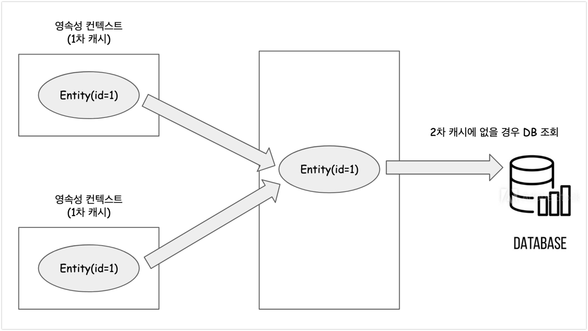

# 1차 캐시 vs 2차 캐시, 그리고 JPA의 2차 캐시 설정

# 목차

[TOC]

# 참고자료

- [JPA 자바 ORM 프로그래밍](https://ridibooks.com/books/3984000009)
- [JPA Cache - gunu-ko.github.io](https://gunju-ko.github.io/jpa/2019/01/14/JPA-2%EC%B0%A8%EC%BA%90%EC%8B%9C.html)
- [velog - first level cache, second level cache](https://velog.io/@dnjscksdn98/JPA-Hibernate-First-Level-Cache-Second-Level-Cache)
- [docs.jboss.org/hibernate](https://docs.jboss.org/hibernate/jpa/2.1/api/javax/persistence/Cache.html)


# 1차 캐시 vs 2차 캐시

아래는 직접 책을 보고 구글 슬라이드에서 그려본 1차캐시와 2차 캐시, Database 간의 관계이다.



자잘한 설명들을 모두 제외하고 개인적인 의견을 조금 섞어서 요약해보면 이렇다.

- 1차 캐시는 영속성 컨텍스트에 존재하는 저장소이다. 트랜잭션 단위로 존재한다. 
- 2차 캐시는 애플리캐이션 단계에서 존재하는 저장소이다. 애플리케이션을 재기동하면 캐시도 재기동시켜야 하거나, 같이 재기동 된다.
- 캐시를 사용하는 이유(조금은 뜬금없긴 하지만...)는 잦은 DB 접근 횟수를 일정수준 이상 줄이게 된다면 DB에 대한 부담이 줄어들기 때문에 사용한다. 물론 세부적으로 업무에 맞게끔 작업을 할 경우는 성격에 따라 캐시를 쓰는 로직이 있고, 캐시를 쓰지 않는 로직이 있도록 작성하는 경우 역시 존재한다.


## 1차 캐시

- 1차 캐시는 끄고 켤 수 없는 옵션이 아니다. 
- 1차 캐시는 영속성 컨텍스트 내부에 있다. (영속성 컨텍스트 자체가 사실상 1차캐시이다.)
- 엔티티 매니저로 조회하거나 변경하는 모든 엔티티는 1차 캐시에 저장된다. 

- **트랜잭션을 시작하고 종료할 때 까지만 1차 캐시가 유효하다.**

  (즉, 트랜잭션의 범위에서 유효한 것이 1차 캐시라는 의미인 듯 하다.)

- 트랜잭션을 커밋하거나, 플러시를 호출할 때 1차 캐시에 있는 엔티티의 변경 내역을 데이터베이스에 동기화 한다.

J2EE, 스프링 프레임워크 등의 프레임워크에서 JPA를 실행할 때 

- 트랜잭션을 시작하면서 영속성 컨텍스트를 생성하고
- 트랜잭션을 종료하면서 영속성 컨텍스트를 종료한다.

OSIV를 사용하면 요청(ex. HTTP)의 시작부터 끝까지 같은 영속성 컨텍스트를 유지한다.

( OSIV 에 대해서는 잘 모르겠다. 검색을 해봐야 할 듯하다.)

이런 이유로 애플리케이션 전체로 보면 데이터베이스 접근 횟수를 획기적으로 줄이지는 못한다.


## 2차 캐시

> ehcache, etc

- 2차 캐시는 애플리케이션 범위의 캐시이다. (애플리케이션 레벨에서 공유되는 캐시이다.)

  - 따라서 애플리케이션을 종료할 때 까지 캐시가 유지된다.
  - 앞에서 정리한 1차 캐시는 트랜잭션 범위였다. 트랜잭션이 종료되면 영속성 컨텍스트도 종료한다.
  - 일반적으로 2차 캐시(second level cache, L2 cache)라고 부른다.
  - **영속성 유닛 범위의 캐시**라고 이야기 하기도 한다.
  - 데이터베이스 기본 키를 기준으로 캐시하지만, 영속성 컨텍스트가 다르면, 객체 동일성(a == b)를 보장하지 않는다.
  - (영속성 컨텍스트는 위에서 정리했듯이 1차 캐시이다.)

  

- 애플리케이션 레벨에서 공유하는 캐시를 JPA는 공유 캐시(shared cache)라고 한다.  

  

- 엔티티 매니저로 데이터를 조회할 때 2차 캐시가 있다면, 2차 캐시에서 찾고, 없으면 데이터베이스에 조회를 한다.  

  

- 2차 캐시를 적절히 활용하면 데이터 베이스 조회 및 횟수를 획기적으로 줄일 수 있다.  

  

- 2차 캐시는 동시성을 극대화하기 위해 캐시한 객체를 직접 반환하지 않는다. 대신 복사본을 만들어서 반환한다.  

  - 캐시한 객체를 그대로 반환할 경우 여러 곳에서 같은 객체를 동시에 수정해야 하는 문제가 발생할 수 있다. 이런 이유로 객체에 락을 걸어서 동기화를 하는데, 이렇게 하면 성능상에 문제가 생길 수 밖에 없다.  
  - 락을 거는 것으로 인한 비용보다, 객체를 복사하는 비용이 훨씬 저렴할 수 있다. 이런 이유로 2차 캐시는 캐시한 객체의 원본을 그대로 리턴하는 것이 아니라 복사본을 리턴한다.  

  

# JPA 에서 2차 캐시 설정

## JPA vs JPA 구현체 라이브러리

JPA의 구현체 대부분은 각각의 캐시 기능을 각자 지원했다. JPA 2.0 부터 캐시 표준이 생겼다. JPA 캐시 표준은 여러 구현체가 공통으로 사용하는 부분들을 표준화했다. (세밀한 설정을 하려면 각 구현체에 의존적인 기능을 사용해야 한다.)  

  

## 캐시 모드 설정

### 요약

- persistence.xml 또는 application.yml/application.properties에 shared-cache-mode 항목에 대한 값을 지정해준다.

- Entity 클래스에 @Cacheable 애노테이션을 통해 2차 캐시를 사용할 것임을 알려준다.

  - Cacheable의 기본값은 true 이다.
  - (Cacheable(true), Cacheable(false))


### SharedCacheMode 의 옵션들

application.yml 또는 persistence.xml 에 설정하는 SharedCacheMode 는 enum 타입이다.

- ALL 

  - 모든 엔티티를 캐시한다.

- NONE

  - 캐시를 사용하지 않는다.

- ENABLE_SELECTIVE

  - Cacheable(true) 로 설정된 엔티티만 캐시를 적용한다.

- DISABLE_SELECTIVE

  - 모든 엔티티를 캐시하는데, Cacheable(false)로 명시된 엔티티만 캐시하지 않는다.

- UNSPECIFIED

  - JPA 구현체가 정의한 설정을따른다.


### 스프링 설정 / persistence.xml 설정

#### XML Configuration

xml 설정으로 빈(bean)을 정의할 수 있다는 것은 Java Config로도 설정할 수 있다는 의미이다.

```xml
<bean id="entityManagerFactory" class="org.springframework.orm.jpa.LocalContainerEntityManagerFactoryBean">
    ...
    <property name="sharedCacheMode" value="ENABLE_SELECTIVE"/>
</bean>
```


#### application.yml

> 참고자료 : [https://velog.io/@dnjscksdn98/JPA-Hibernate-First-Level-Cache-Second-Level-Cache](https://velog.io/@dnjscksdn98/JPA-Hibernate-First-Level-Cache-Second-Level-Cache)

- spring.jpa.properties.hibernate.cache.use_second_level_cache = true
- spring.jpa.properties.hibernate.cache.region.factory_class
- spring.jpa.properties.hibernate.generate_statistics = true

```properties
spring:
  jpa:
    properties:
      hibernate:
        generate_statistics: true
        # ...
        cache:
          use_second_level_cache: true
          region:
            factory_class: org.hibernate.cache.ehcache.EhCacheRegionFactory
            
      javax:
        persistence:
          sharedCache:
            mode: ENABLE_SELECTIVE
```


#### persistence.xml

```xml
<persistence-unit name="test">
    <shared-cache-mode>ENABLE_SELECTIVE</shared-cache-mode>
</persistence-unit>
```


### Entity에 @Cacheable 설정

아래와 같이 `@Cacheable` 애노테이션을 엔티티에 설정할 수 있다. @Cacheable 은 true, false 를 주어 설정가능하다.(@Cacheable(true), @Cacheable(false))

```java
@Cacheable
@Entity
public class Member{
  
  @Id @GeneratedValue
  private Long id;
  
  // ...
}
```


## @Cahcheable vs @Cache

> 참고자료 : https://velog.io/@dnjscksdn98/JPA-Hibernate-First-Level-Cache-Second-Level-Cache

@Cacheable 말고도 @Cache 를 사용할수도 있다. 두 어노테이션의 차이점을 정리해보면 아래와 같다.

- @Cacheable
  - 엔티티에 2차 캐시 적용시 사용하는 애노테이션
- @Cache
  - 하이버네이트 전용
  - 캐시관련된 세밀한 설정을 할때 사용
  - 이 @Cache 에 대해서는 책의 맨 뒤에서 설명하고 있다.
  - 또는 컬렉션 캐시를 적용할 때에도 사용한다.


```java
@Cacheable
@Cache(usage = CacheConcurrencyStrategy.READ_WRITE)
@Entity
public class Course {

    @Id 
    @GeneratedValue
    private Long id;
    
    @Column(nullable = false, length = 100)
    private String name;

    @Cache(usage = CacheConcurrencyStrategy.READ_WRITE)
    @OneToMany(mappedBy = "course")
    private List<Review> reviews = new ArrayList<>();
    ...
}
```


# EntityManager 캐시 방식 지정 (캐시 조회/저장)

QueryDsl 을 쓰든 data jpa를 쓰든, 순수  JPA를 쓰든 쿼리를 날리려면 결국은 EntityManager 인스턴스를 활용하게 된다. 이때 EntityManager를 사용하여 쿼리를 수행할 때에 캐시 옵션을 지정하는 것 역시 가능하다.  

  

이 때, 엔티티 매니저가 캐시를 이용해 아래의 동작을 수행하도록 지정하는 것이 가능하다.

- 캐시를 무시하고, 데이터베이스를 직접조회하거나
- 캐시를 갱신하려면

캐시 조회모드 또는 캐시 보관 모드를 사용한다.  

  

아주 짤막한 구문을 살펴보면 아래와 같다.

```java
em.setProperty("javax.persistence.cache.retrieveMode", CacheRetrieveMode.BYPASS);
```

  

캐시 조회 모드, 보관모드에 지정하는 킷값들의 종류는 아래와 같다.

- javax.persistence.cache.retrieveMode
  - 캐시 조회 모드를 지정할 때 사용하는 키
- javax.persistence.cache.storeMode
  - 캐시 보관 모드를 지정할때 사용하는 키


각 키에 해당하는 Value 를 지정해주고자 할 때 아래의 옵션들을 사용한다.

- javax.persistence.CacheRetrieveMode
  - 캐시 조회 모드 지정시에 Map 의 Value 로 지정
  - USE
    - 캐시에서 조회 (기본값)
  - BYPASS 
    - 캐시를 무시하고 데이터베이스에 직접 접근


- javax.persistence.CacheStoreMode
  - 캐시 보관 모드 지정시에 Map 의 Value 로 지정
  - USE
    - 조회한 데이터를 캐시에 저장
    - 조회한 데이터가 이미 캐시에 있으면 캐시 데이터를 최신으로 업데이트 하지 않는다.
    - 트랜잭션을 커밋하면 등록 수정한 엔티티도 캐시에 저장한다. (기본값)
  - BYPASS
    - 캐시에 저장하지 않는다.
  - REFRESH
    - USE 전략에서 새로고침도 되게끔 하는 옵션
    - USE 전략을 그대로 사용하되 데이터베이스에서 조회한 엔티티를 최신상태로 다시 캐시


**select 구문 예제**  

```java
Map<String, Object> param = new HashMap<String, Object>();
param.put("javax.persistence.cache.retrieveMode", CacheRetrieveMode.BYPASS);
param.put("javax.persistence.cache.storeMode", CacheStoreMode.BYPASS);
em.find(TestEntity.class, id, param)
```


**JPQL 예제**

```java
em.createQuery("select e from TestEntity e where e.id = :id", TestEntity.class)
  .setParameter("id", id)
  .setHint("javax.persistence.cache.retrieveMode", CacheRetrieveMode.BYPASS)
  .setHint("javax.persistence.cache.storeMode", CacheStoreMode.BYPASS)
  .getSingleResult();
```


# JPA 캐시 관리 API

JPA에는 javax.persistence.Cache 인터페이스가 있다. Cache 인스턴스를 얻어내는 것은 EntityManagerFactory 로 구해낼 수 있다.

  

## Cache 인스턴스 얻어오기

**ex)  Cache 인스턴스 얻어내기**  

```java
Cache cache = emf.getCache();
boolean contains = cache.contains(TestEntity.class, testEntity.getId());
System.out.println("contains = " + contains);
```

  

## Cache 인터페이스의 메서드들

>  참고자료 : [docs.jboss.org/hibernate](https://docs.jboss.org/hibernate/jpa/2.1/api/javax/persistence/Cache.html)

- contains (java.lang.Class class, java.lang.Object primaryKey) : boolean
  - 해당 엔티티가 캐시에 있는지에 대한 여부를 확인
- evict (java.lang.Class cls)
  - 해당 엔티티 중 특정 식별자를 가진 엔티티를 캐시에서 제거
- evict (java.lang.Class cls, java.lang.Object primaryKey)
  - 해당 엔티티 전체를 캐시에서 제거
- evictAll()
  - 모든 캐시 데이터 제거
- unwrap(java.lang.Class\<T\> cls)
  - JPA Cache 구현체 조회


